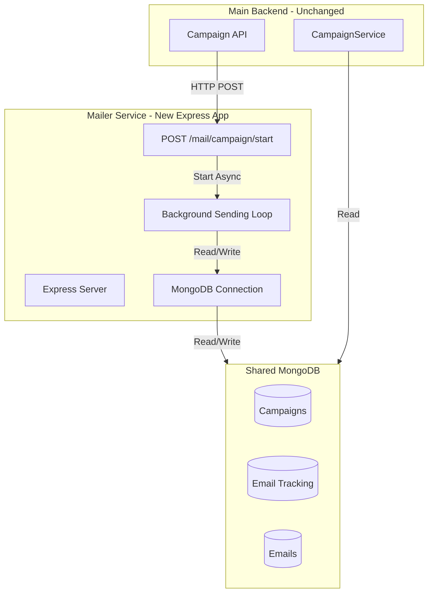

# Express Mailer Service Implementation Plan

## Overview
Create a separate Express TypeScript server (`mailer-service/`) that handles all email sending logic, while keeping the main backend (`src/`) completely unchanged for reverse compatibility. The mailer service will run on each SMTP VPS and process campaigns via HTTP endpoints.

## Architecture



## Directory Structure

```
mms-backend/
├── src/                          # Main backend (UNCHANGED)
├── mailer-service/               # NEW: Express mailer service
│   ├── src/
│   │   ├── server.ts            # Express app entry point
│   │   ├── routes/
│   │   │   └── mail.routes.ts    # POST /mail/campaign/start, GET /health
│   │   ├── services/
│   │   │   ├── campaign.service.ts    # Ported sending logic
│   │   │   └── mailer.util.ts         # SMTP transporter creation
│   │   ├── models/
│   │   │   ├── campaign.model.ts      # Mongoose models
│   │   │   ├── tracking.model.ts
│   │   │   └── email.model.ts
│   │   ├── middleware/
│   │   │   └── auth.middleware.ts     # Token authentication
│   │   └── config/
│   │       └── database.config.ts    # MongoDB connection
│   ├── package.json
│   ├── tsconfig.json
│   ├── Dockerfile
│   └── .env.example
```

## Implementation Steps

### Step 1: Create Mailer Service Directory Structure
- Create `mailer-service/` at root level
- Set up TypeScript Express project structure
- Initialize `package.json` with Express, Mongoose, Nodemailer dependencies

### Step 2: Port MongoDB Models
- Copy and adapt schemas from main backend:
  - `Campaign` model (from `src/campaign/schemas/campaign.schemas.ts`)
  - `CampaignEmailTracking` model
  - `Email` model (from `src/email/schemas/email.schemas.ts`)
- Use plain Mongoose (no NestJS decorators) for Express compatibility

### Step 3: Port SMTP Utility
- Copy `createTransporter` logic from `src/email/mailer.util.ts`
- Adapt to work in Express context (no NestJS dependencies)

### Step 4: Implement Background Sending Loop
- Port the core sending logic from `src/campaign/campaign.processor.ts`:
  - `process()` method → `runCampaignInBackground(campaignId, options)`
  - Keep exact same logic:
    - Check campaign status before each batch
    - Fetch pending recipients
    - Send emails with nodemailer
    - Bulk insert email records
    - Bulk update tracking records
    - Mark campaign as completed when done
    - Call cleanup function
- Use Map to track running campaigns: `runningCampaigns: Map<string, Promise>`

### Step 5: Create Express Routes
- `POST /mail/campaign/start`:
  - Authenticate via `X-Mailer-Token` header
  - Validate request body (campaignId, batchSize, delay, etc.)
  - Check if campaign already running (idempotency)
  - Start background loop (fire-and-forget, don't await)
  - Return 200 immediately with success message
- `GET /mail/health`:
  - Return mailer status, active campaigns list
- `GET /mail/queue` (optional):
  - Return queue status for monitoring

### Step 6: Implement Authentication Middleware
- Verify `X-Mailer-Token` header matches `MAILER_AUTH_TOKEN` env var
- Reject requests without valid token (401)

### Step 7: MongoDB Connection Setup
- Connect to same MongoDB as main backend
- Use connection string from `MONGO_URI` env var
- Handle connection errors gracefully

### Step 8: Environment Configuration
- Create `.env.example` with required variables:
  - `PORT` (default: 4000)
  - `MONGO_URI`
  - `MAILER_AUTH_TOKEN` (shared secret with backend)
  - `MAILER_ID` (unique identifier for this VPS)
  - `SMTP_HOST`, `SMTP_PORT`, `SMTP_USER`, `SMTP_PASS` (optional, if using fixed SMTP)
  - `ROOT_MAIL_USER_PASSWORD` (for SMTP auth)

### Step 9: Docker Configuration
- Create `Dockerfile` for mailer service
- Multi-stage build for production
- Expose port 4000
- Use environment variables for configuration

### Step 10: Testing & Validation
- Test single campaign sending
- Test pause/resume (status check in loop)
- Test multiple campaigns (if supported)
- Verify MongoDB writes match main backend expectations

## Key Implementation Details

### Background Loop Pattern
```typescript
// In campaign.service.ts (mailer service)
const runningCampaigns = new Map<string, Promise<void>>();

async function runCampaignInBackground(campaignId: string, options: CampaignOptions) {
  // Port exact logic from CampaignProcessor.process()
  // Check status before each batch
  // Fetch pending, send, update MongoDB
  // Exit when paused or completed
}

// In route handler
app.post('/mail/campaign/start', async (req, res) => {
  const { campaignId, ...options } = req.body;
  
  if (runningCampaigns.has(campaignId)) {
    return res.json({ success: true, message: 'Already running' });
  }
  
  res.json({ success: true, message: 'Started' });
  
  const promise = runCampaignInBackground(campaignId, options)
    .catch(err => console.error('Campaign error:', err))
    .finally(() => runningCampaigns.delete(campaignId));
  
  runningCampaigns.set(campaignId, promise);
});
```

### Pause/Resume Handling
- **Pause**: Main backend sets `campaign.status = 'paused'` in MongoDB
- **Mailer loop**: Checks status at start of each batch iteration, exits if not 'running'
- **Resume**: Main backend sets `status = 'running'` and calls `POST /mail/campaign/start` again
- Mailer starts new background loop, picks up remaining `pending` emails

### MongoDB Compatibility
- Use same collection names: `campaigns`, `campaign_email_tracking`, `emails`
- Write same document structure as main backend
- Ensure `getCampaignStats` in main backend continues to work correctly

## Files to Create

1. `mailer-service/package.json` - Express, Mongoose, Nodemailer dependencies
2. `mailer-service/tsconfig.json` - TypeScript config (similar to main backend)
3. `mailer-service/src/server.ts` - Express app setup
4. `mailer-service/src/routes/mail.routes.ts` - HTTP endpoints
5. `mailer-service/src/services/campaign.service.ts` - Ported sending logic
6. `mailer-service/src/services/mailer.util.ts` - SMTP transporter
7. `mailer-service/src/models/campaign.model.ts` - Mongoose models
8. `mailer-service/src/models/tracking.model.ts`
9. `mailer-service/src/models/email.model.ts`
10. `mailer-service/src/middleware/auth.middleware.ts` - Token auth
11. `mailer-service/src/config/database.config.ts` - MongoDB connection
12. `mailer-service/Dockerfile` - Docker configuration
13. `mailer-service/.env.example` - Environment template
14. `mailer-service/README.md` - Setup instructions

## Reverse Compatibility

- **Main backend remains completely unchanged** during this implementation
- Main backend continues to use BullMQ for now
- Once mailer service is tested, main backend can be updated to call mailer HTTP endpoints instead of BullMQ (future step)
- Both systems can run in parallel during transition

## Security Considerations

- All endpoints require `X-Mailer-Token` header
- Token stored in environment variable (never in code)
- Network-level restrictions: mailer should only accept connections from main backend IPs
- MongoDB connection uses authentication and TLS

## Next Steps After Implementation

1. Test mailer service locally
2. Deploy to one SMTP VPS for testing
3. Update main backend to optionally call mailer HTTP endpoint (feature flag)
4. Gradually migrate campaigns to use mailer service
5. Remove BullMQ dependency from main backend once fully migrated
